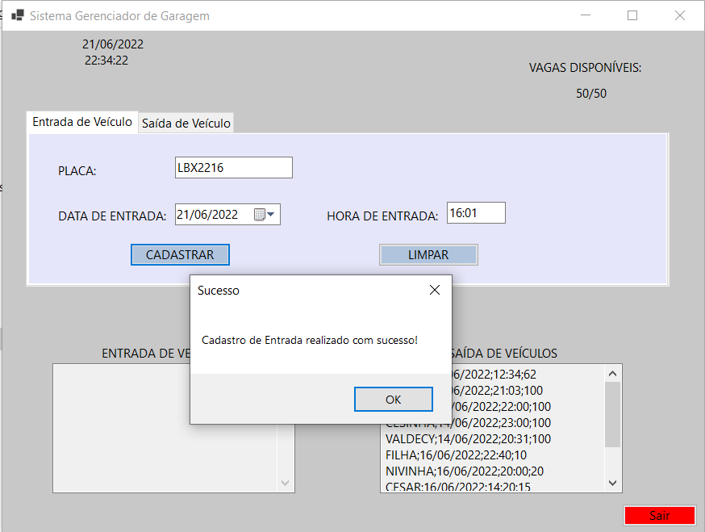
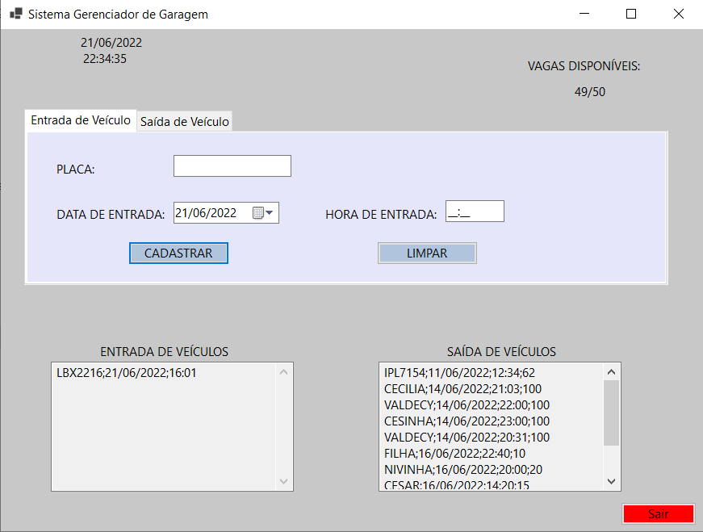
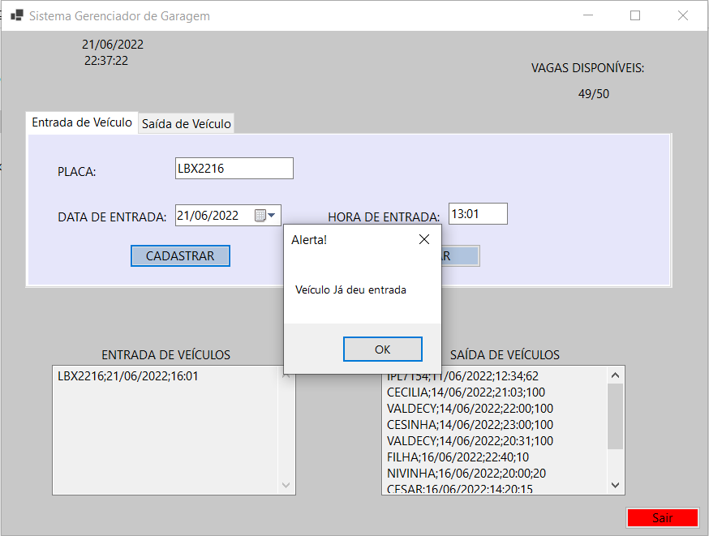
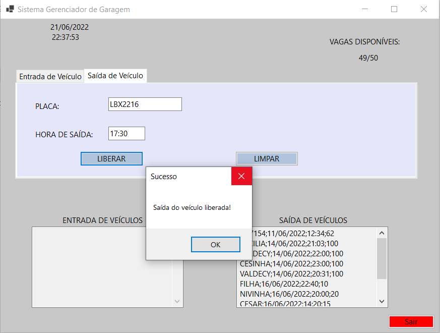
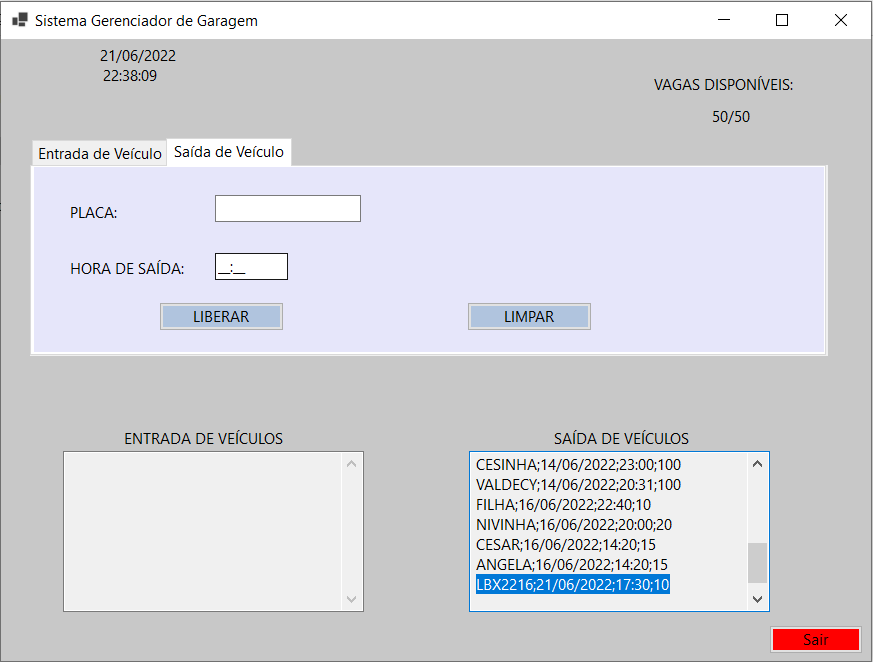

<h1>Tela inicial do programa de garagem.</h1>

Caso o campo placa esteja digitado e a hora de entrada, o sistema
assume que a data de entrada é a data vigente do sistema, se tiver uma data selecionada, ele aceita a data marcada pelo usuário.

Ao clicar no botão "Cadastrar", a linha é inserida e apresentada a mensagem de "Cadastro de entrada realizado com sucesso".

Caso seja feita a entrada do veículo novamente, o sistema critica
e avisa que o veículo já deu entrada.

Ao digitar na aba saída de veículo, um veículo que esteja na lista de entrada.
O sistema irá calcular a saída de acordo com a hora da saída.

Informação da saída, com o valor a ser cobrado.

